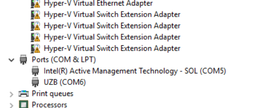
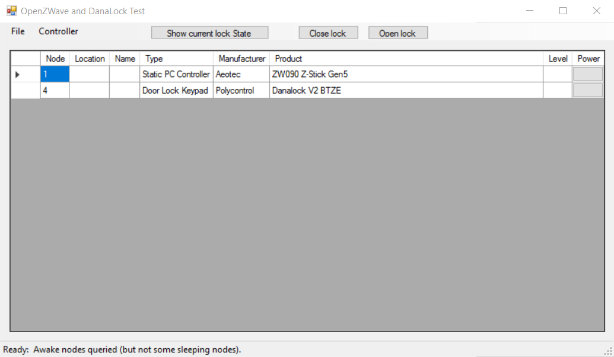

# DanaLock and Open-ZWave (.NET)
==================

This tutorial will explain howto open/close the DanaLock using OpenZWave and .NET. This example is a slightly modified version of OpenZWave example.


## Requirements

- Z-Wave Controller: Eg: Z-Stick Gen5 from Aeon Labs
- Visual Studio (I used 2017 RC)
- Dana Lock Door lock (I used DanaLock Circle V2. https://danalock.com/?page_id=35)


## Preparation

1) Install driver (if using Windows):

https://aeotec.freshdesk.com/support/solutions/articles/6000034892-install-z-stick-gen5-drivers-inf-on-windows

2) Go to computer management and take note of the COM port name
Mine is COM6: See this image: 




## How to use

1) Open the solution **OZWForm.sln** under **dotnet\examples\OZWForm\src\**


2) **Important**: Edit the network security key under **config\options.xml**

```xml
<Option name="NetworkKey" value="0x01, 0x02, 0x03, 0x04, 0x05, 0x06, 0x07, 0x08, 0x09, 0x0A, 0x0B, 0x0C, 0x0D, 0x0E, 0x0F, 0x10" />
```

3) Include the secure device using this example app. See 

https://github.com/OpenZWave/open-zwave/wiki/Adding-Security-Devices-to-OZW 

for more info

But basically it comes down to :

- If DanaLock was already added to a network, remove it (so it can accept the new security key)
- Add secure device using this example app (controller, add secure device in menu). Then push the middle button on the DanaLock to start the inclusion process.

2) In OZWForm edit so the right COM port name is used

```csharp
// Add a driver
m_driverPort = @"\\.\COM6";
m_manager.AddDriver(m_driverPort);
//m_manager.AddDriver(@"HID Controller", ZWControllerInterface.Hid);
```

3) Edit the node id so that it is the same as your node id. Change these lines of code:

```csharp
new ZWValueID(m_homeId, 0x4, ZWValueID.ValueGenre.Basic, 0x62, 1, 0, ZWValueID.ValueType.Bool, 0);
```

to 

```csharp
new ZWValueID(m_homeId, 0x?, ZWValueID.ValueGenre.Basic, 0x62, 1, 0, ZWValueID.ValueType.Bool, 0);
```

where ?? is your node id


4) Verify **configuration manager** is correct:

**OZWForm**  should be **x86**

5) Make sure **OZWForm** is the **startup project**.

6) Build and start the solution

You should see something like:




## Extra Help

Check Visual Studio output for errors/hint. You can also try to use the Zencys tool if you have a compatible Z-Stick. 

## References

[Open Z-Wave Official website](http://www.openzwave.com/)

[Open Z-Wave Official GitHub](https://github.com/openzwave/)

[Zencys tool](https://aeotec.freshdesk.com/support/solutions/articles/6000110204-zensys)


